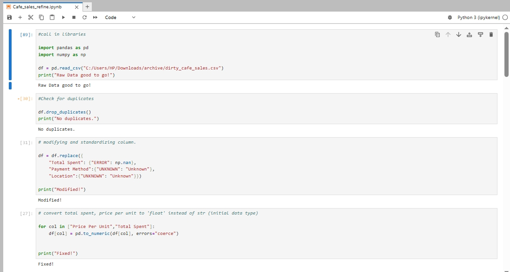
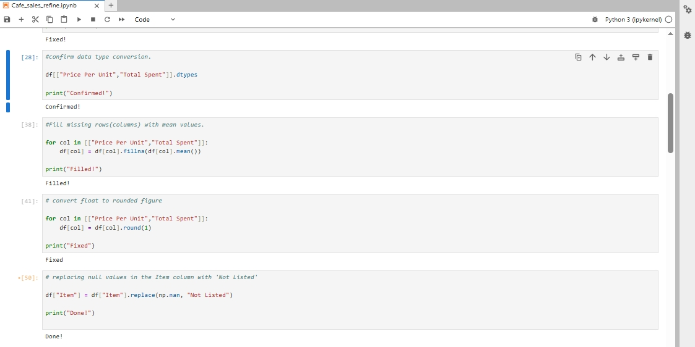
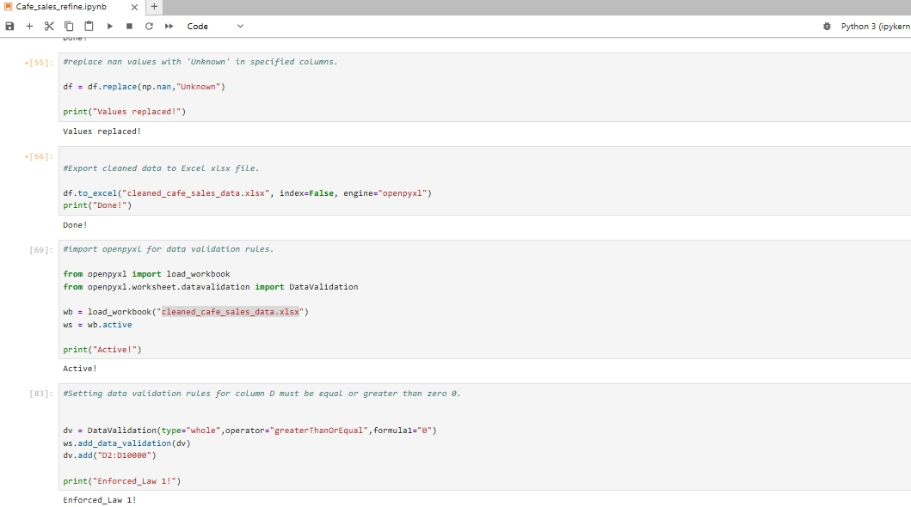
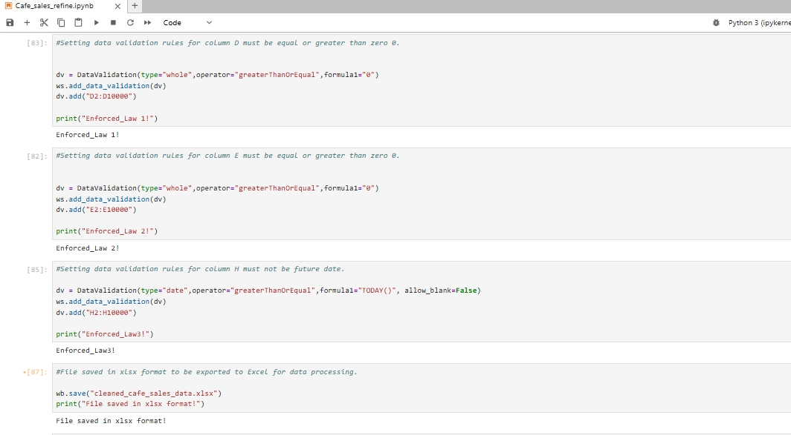
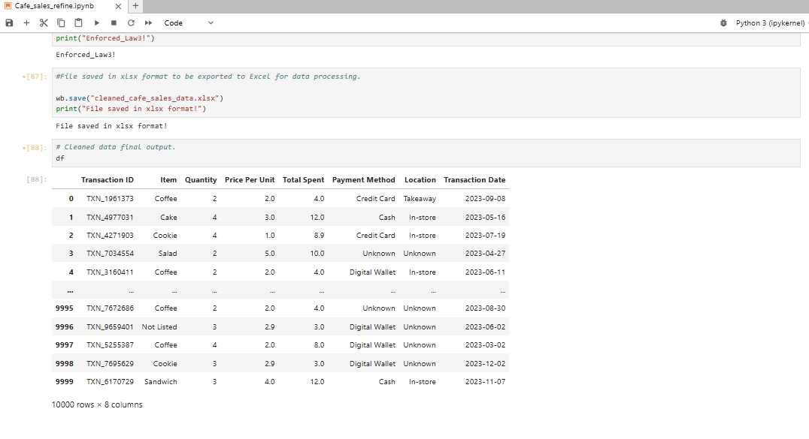

# Python - Data Cleaning project.

# Table of Contents

- [Goal](#Goal)
- [Tools](#Tools)
- [Screenshots](#Screenshots)

## Goal 

The goal is to have a ready to use data for analysis, machine learning algorithms. The process of cleaned data consist of no-duplicates, fill missing values with (mean, median,mode), standardized data, ensure date, categorical and numeric columns remain as it should. Data quality check passed, to maintain data integrity and data be converted to CSV format.

## Tools

|Tools | Purpose| 
|---|---|
|Python (Pandas, Numpy, Openpyxl) | Cleaning, Xlsx Data to CSV |

## Screenshots

